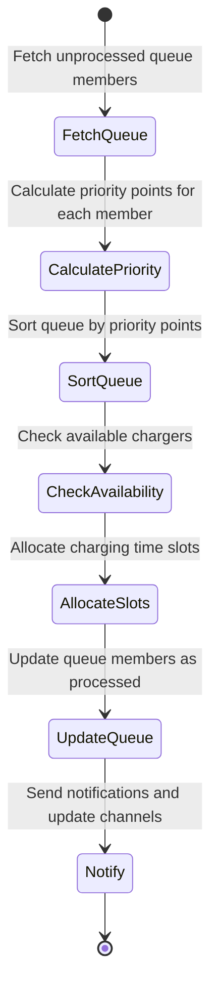
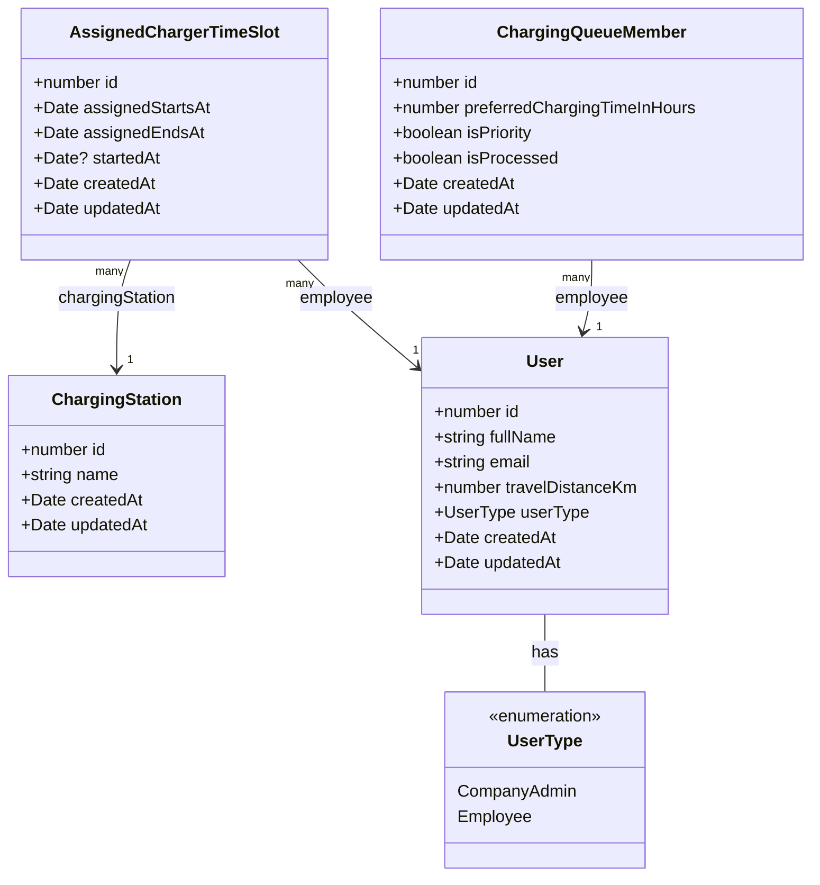

## How to run the app
my dev environment:
- node 24
- docker + docker-compose for easy db startup

1. run the DB using Docker. It runs on port 5432.
```
cd rivian-challenge-back
docker-compose up -d
```
2. install dependencies and run the backend
```
cd rivian-challenge-back
npm install
npm run start:dev
```
3. install dependencies and run the frontend
```
cd rivian-challenge-front
npm install
npm run dev
```

I've added 3 default users with the following emails: admin@rivian.com, employee1@rivian.com, employee2@rivian.com.
You can login with admin@rivian.com to add a couple charging stations; you can also add more employees.
you can then see the UI for employees by logging in with one of employee emails.

Auth is very basic - did it to avoid complications there - but it works on the principle of stateles tokens. 
So don't judge :D

## Queuing algorithm

Code should be self explanatory.
Everyting is centered around the idea of priority queue points.
They're calculated for each queue entry and then the queue entries are sorted based on the calculated points.
There are multiple configurable, albeit hardcoded, parameters for priority points calculation on the backend, inside src/station-queuing/constants.ts file.
I would love for the algorithm to be less hardcoded; I’d like if I’d have more factors that were determined based on historical data.

## Priority points formula and pseudocode for queuing algorighm

```
const points = positionInQueue * QUEUE_ORDER_POINTS_FACTOR +
      travelDistanceKm * DISTANCE_POINTS_FACTOR +
      (isPriority ? PRIORITY_POINTS : 0) +
      (alreadyChargedToday ? ALREADY_CHARGED_TODAY_POINTS : 0);
```

`ALREADY_CHARGED_TODAY_POINTS` is negative. If someone has already charged their car today, they're put much lower in the queue.

The following pseudocode is executed every 15 minutes using a NestJS cron job.

- load queued entries
- calculate priority points for each entry
- sort entries by priority points
- load available chargers
- if not available chargers exist
    - exit (wait for the next cron job iteration)
 - determine maximum charge length based on queue demand
 - reserve a time slot on free chargers for each queued entry
 - notify and message if needed

**Here's also a simple flow chart:**

  

## Possible different ways of implementing the algorithm and possible improvements

One simpler solution that I had in mind was to register employee check ins up until 10am;
during check in, they’d also express if they plan to use the charger and if their charge is a priority charge.
We can assume that not that many, if any employees would come to work after 10am.
We could create a fixed schedule at that time.
I think that would be more fair; reason being, no matter how well adjusted high demand detection, we can still run into problems where some people get more charging time,
simply because they requested it earlier; by creating a predefined schedule + leaving a little bit of charger time free for people who are late, we could avoid such problems altogether.

One more approach would be to integrate the system with the EV car software; that way, we could even know how charged someone’s car is even without asking them.
Combined with charging rate data, that would help our system to make much more informed decisions about how to assign charger time.

## Operating conditions assumptions

The entire queuing algorighm, as it is at the moment, is reliant on the premise that all the cars and all the chargers charge at the same rate; that’s not true. 
A better, more comprehensive algorithm, would take charging rate (in KW) into account, not only charging time.
Also, to be maximally fair, besides taking distance from work into account, we should also consider kWh mileage of the car - kWh per km.
So, to reiterate, the queuing algorithm that I implemented relies on three important assumptions:
- all cars charge at the same rate
- all cars spend same amount of energy per unit of distance
- all chargers are the same

## Technical limitations of the solution

The code that I implemented is a prototype.
I’ve build it in a couple of hours of work.
I would’ve spent some time reworking it if I had more time.
List of flaws, not limited to:
- I use the so called VeryWeakAuth. Did it just to demo how auth can be implemented in nestJS. Would've been very similar for JWT tokens, we'd only add one more thing that we'd check - signature.
- I don’t have migrations. Adding default users via code hack.
- I don’t have a full API documentation. I'd love to document everything better; did it somewhat in a rush. Added swagger just to demo that I know what swagger is :D
- not all API endpoints are safe - specifically, CRUD endpoints for Company Admin, both for users and for charging stations
- the app isn’t perfectly designed; would be nicer if there were some loading bars and nicer visualisations
- what are automated tests? Doesn’t seem this code I wrote knows.

## How I would build a system like this if I had more time

I’d spend a couple of days designing only queuing algorithms and testing them under different demands.
That’s the center of this solution; CRUD and visualizations are easy to implement, compared to a good algorithm.
I’d also love to talk to people who use the chargers for which I’m designing this system.
Without understanding their pain points that I’m supposed to eliminate, I could completely miss the point with the solution.
I’m not sure that I even see people using something like this for private charging stations; public - more likely, but we’d also need a mobile app and more notifications etc.

## UML diagram of the entities in the system just to show that I know what UML diagrams are


